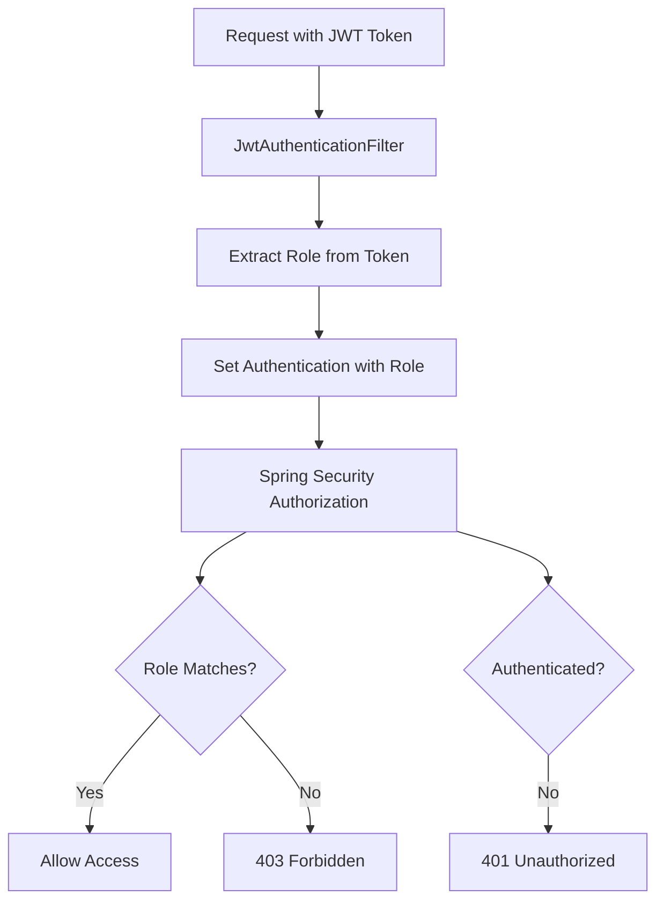

## Overview

Authorization in the User Management System is implemented using Spring Security's role-based access control (RBAC). After a user is authenticated via JWT, their role determines which endpoints they can access.

## Role-Based Access Control (RBAC)

The system uses two primary roles:

- **ROLE_USER**: Standard user with access to basic user operations
- **ROLE_ADMIN**: Administrator with elevated privileges

### How RBAC Works



<Info>
Authorization happens **after** authentication. The `JwtAuthenticationFilter` first validates the token and extracts the user's role, then Spring Security's authorization mechanism checks if that role has permission to access the requested endpoint.
</Info>

## Protected Endpoints

Endpoint protection is configured in `SecurityConfig.java:27-31` using Spring Security's `authorizeHttpRequests` DSL:

```java
.authorizeHttpRequests(authz -> authz
        .requestMatchers("/auth/**").permitAll()
        .requestMatchers("/users/me").hasAnyAuthority("ROLE_USER")
        .requestMatchers("/admin/users").hasAnyAuthority("ROLE_ADMIN")
)
```

### Endpoint Access Requirements

| Endpoint | Method | Required Role | Description |
|----------|--------|---------------|-------------|
| `/auth/signup` | POST | None (Public) | Register a new user |
| `/auth/login` | POST | None (Public) | Authenticate and receive JWT token |
| `/users/me` | GET | `ROLE_USER` | Get current user information |
| `/admin/users` | GET | `ROLE_ADMIN` | List all users (admin only) |

<Note>
The `/users/me` endpoint requires `ROLE_USER`, which means both regular users and admins can access it (since admins typically also have user permissions in many systems). However, based on this configuration, only users with exactly `ROLE_USER` can access it.
</Note>

## How Spring Security Enforces Authorization

Spring Security enforces authorization through a series of filters and security interceptors. Here's the complete flow:

### 1. JWT Authentication Filter

The `JwtAuthenticationFilter` runs first and extracts the role from the JWT token (`JwtAuthenticationFilter.java:33`):

```java
String role = jwtUtil.getRoleFromToken(token);
```

It then creates an authentication object with the role as a `GrantedAuthority` (`JwtAuthenticationFilter.java:35-39`):

```java
UsernamePasswordAuthenticationToken authToken = new UsernamePasswordAuthenticationToken(
        username,
        null,
        Collections.singletonList(new SimpleGrantedAuthority(role))
);
```

### 2. Security Context

The authentication object is stored in Spring Security's `SecurityContextHolder` (`JwtAuthenticationFilter.java:41`):

```java
SecurityContextHolder.getContext().setAuthentication(authToken);
```

This makes the authentication information available throughout the request lifecycle.

### 3. Authorization Decision

When the request reaches a protected endpoint, Spring Security's `AuthorizationFilter` checks if the user's authorities match the required authorities for that endpoint.

For example, when accessing `/admin/users`:
1. Spring Security retrieves the authentication from `SecurityContextHolder`
2. It extracts the `GrantedAuthority` list (containing the role)
3. It compares against the required authority: `ROLE_ADMIN`
4. If the role matches, access is granted; otherwise, a `403 Forbidden` response is returned

### Filter Chain Order

The `JwtAuthenticationFilter` is added **before** Spring Security's default authentication filter (`SecurityConfig.java:32`):

```java
.addFilterBefore(jwtAuthenticationFilter, UsernamePasswordAuthenticationFilter.class);
```

This ensures JWT validation happens first in the filter chain.

## Authorization vs Authentication

It's important to understand the difference:

<CardGroup cols={2}>
  <Card title="Authentication" icon="key">
    **Who are you?**
    
    Verifies the user's identity through JWT token validation. Handled by `JwtAuthenticationFilter`.
  </Card>
  <Card title="Authorization" icon="shield-check">
    **What can you do?**
    
    Determines if the authenticated user has permission to access a resource. Handled by Spring Security's authorization filters.
  </Card>
</CardGroup>

## Stateless Authorization

The system uses stateless authorization, meaning:

```java
.sessionManagement(session -> session.sessionCreationPolicy(SessionCreationPolicy.STATELESS))
```

**Benefits**:
- No server-side session storage required
- Better scalability (no session replication needed)
- Each request is self-contained

**Implications**:
- The JWT token must be included in **every** request
- Role changes require a new token to be issued
- Token expiration cannot be revoked server-side without additional mechanisms

## Access Denied Scenarios

### 401 Unauthorized

Returned when:
- No JWT token is provided
- JWT token is invalid or expired
- JWT token has an incorrect signature

```bash
# Missing token
curl -X GET http://localhost:8080/users/me
# Response: 401 Unauthorized
```

### 403 Forbidden

Returned when:
- User is authenticated but lacks the required role
- For example, a `ROLE_USER` trying to access `/admin/users`

```bash
# User with ROLE_USER trying to access admin endpoint
curl -X GET http://localhost:8080/admin/users \
  -H "Authorization: Bearer <user_token>"
# Response: 403 Forbidden
```

<Warning>
Make sure your client application handles both 401 and 403 responses appropriately. A 401 should typically trigger a login flow, while a 403 should show an "access denied" message.
</Warning>

## Security Best Practices

### 1. Principle of Least Privilege

Users should be assigned the minimum role necessary for their tasks. By default, new users are assigned `ROLE_USER` (see `User.java:33`):

```java
@Builder.Default
private Role role = Role.ROLE_USER;
```

### 2. Role Validation

Roles are stored as an enum (`Role.java`) to prevent invalid role values:

```java
public enum Role {
    ROLE_USER,
    ROLE_ADMIN
}
```

### 3. Secure Defaults

The security configuration denies access to all endpoints by default unless explicitly permitted:

```java
.authorizeHttpRequests(authz -> authz
        .requestMatchers("/auth/**").permitAll()
        // Only specific endpoints are configured
        // All others require authentication by default
)
```

## Example: Admin Access Flow

Here's how an admin accesses the user list:

<Steps>
  <Step title="Admin Login">
    Admin logs in with credentials and receives a JWT token containing `ROLE_ADMIN`.
  </Step>
  <Step title="Request with Token">
    Admin sends a GET request to `/admin/users` with the token in the Authorization header.
  </Step>
  <Step title="Token Validation">
    `JwtAuthenticationFilter` validates the token and extracts `ROLE_ADMIN`.
  </Step>
  <Step title="Authorization Check">
    Spring Security checks that the endpoint requires `ROLE_ADMIN` and the user has it.
  </Step>
  <Step title="Access Granted">
    The request proceeds to the `UserController.getAllUsers()` method.
  </Step>
  <Step title="Response">
    The list of all users is returned to the admin.
  </Step>
</Steps>

## Controller Implementation

The controllers don't need to manually check roles—Spring Security handles it automatically:

### User Endpoint

```java
// UserController.java:23-27
@GetMapping("/users/me")
@ResponseStatus(HttpStatus.OK)
public UserInfoResponseDTO info(@Valid @RequestBody UserInfoDTO userInfoDTO) {
    return userService.infoUSer(userInfoDTO.getEmail(), userInfoDTO.getPassword());
}
```

### Admin Endpoint

```java
// UserController.java:29-33
@GetMapping("/admin/users")
@ResponseStatus(HttpStatus.OK)
public List<User> getAllUsers() {
    return userService.findAll();
}
```

<Info>
Notice that the controller methods don't contain any authorization logic. The security configuration in `SecurityConfig` handles all authorization concerns, keeping the controller code clean and focused on business logic.
</Info>

## Testing Authorization

### Testing User Access

```bash
# Login as a regular user
curl -X POST http://localhost:8080/auth/login \
  -H "Content-Type: application/json" \
  -d '{"email": "user@example.com", "password": "password123"}'

# Use the token to access user endpoint (should succeed)
curl -X GET http://localhost:8080/users/me \
  -H "Authorization: Bearer <user_token>" \
  -H "Content-Type: application/json" \
  -d '{"email": "user@example.com", "password": "password123"}'

# Try to access admin endpoint (should fail with 403)
curl -X GET http://localhost:8080/admin/users \
  -H "Authorization: Bearer <user_token>"
```

### Testing Admin Access

```bash
# Login as admin
curl -X POST http://localhost:8080/auth/login \
  -H "Content-Type: application/json" \
  -d '{"email": "admin@example.com", "password": "adminpass"}'

# Access admin endpoint (should succeed)
curl -X GET http://localhost:8080/admin/users \
  -H "Authorization: Bearer <admin_token>"
```

## Next Steps

<CardGroup cols={2}>
  <Card title="Roles" icon="users" href="/concepts/roles">
    Learn about specific roles and their permissions
  </Card>
  <Card title="Authentication" icon="key" href="/concepts/authentication">
    Understand how JWT authentication works
  </Card>
</CardGroup>